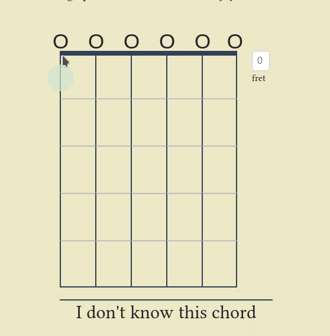
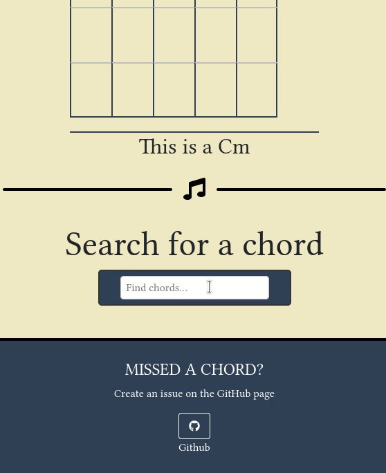

<h1 align="center">Guitar Chord Lookup</h1>

  

  <a href="#overview">Overview</a>
  &nbsp;&nbsp;&nbsp;|&nbsp;&nbsp;&nbsp;
  <a href="#usage">Examples</a>
  &nbsp;&nbsp;&nbsp;|&nbsp;&nbsp;&nbsp;
  <a href="#technologies">Technologies</a>
  &nbsp;&nbsp;&nbsp;|&nbsp;&nbsp;&nbsp;
  <a href="#usage">Usage</a>

## Overview

Remember the guitar chord but not the name? Use reverse guitar chord to lookup the chord name!
  
Make the diagram and get the chord name, or search for the chord name and get the diagram. Guitar Chord Lookup uses the intuitive guitar chord style found on <a href="https://www.ultimate-guitar.com/">Ultimate Guitar</a>. Guitar Chord Lookup has a database of over 100 guitar chords to match your diagrams to and to search from.
  
If you are making a guitar tab and can't remember the exact chord diagram, use the search function. Alternatively, if you remember the chord but not the name, make the diagram on Guitar Chord Lookup and get the name of the chord!

## Examples

> Lookup the chord from the diagram

  

> Lookup the diagram from the chord

  

## Technologies

- HTML / CSS
- JavaScript
- Bootstrap

## Usage

Press the strings on the diagram to make a guitar chord! Press the O's above the strings to represent a closed or open string. To do a barre chord, enter the closed strings first, and then enter the number of the barred fret.

When you change the diagram, we will search over 100 chords and tell you if it matches any of them.

If you know the chord by name but not what it looks like, search for the chord below the diagram. Select the chord you are looking for and it will be displayed on the diagram!

Check the website out <a href="https://alexblackwell.ca/pages/chord/">here</a>!

## License
Licensed under the [GNU General Public License v3.0](LICENSE).
